# Thanonkhondern# -<!DOCTYPE html>
<html>
<title>สวนประวัติศาสตร์</title>
<meta charset="UTF-8">
<meta name="viewport" content="width=device-width, initial-scale=1">
<link rel="stylesheet" href="https://www.w3schools.com/w3css/4/w3.css">
<link rel="stylesheet" href="https://cdnjs.cloudflare.com/ajax/libs/font-awesome/4.7.0/css/font-awesome.min.css">

<body>

  <!-- Navbar (sit on top) -->

  

    <a href="#home" class="w3-bar-item w3-button"><i class="fa fa-bicycle"></i> <b>Songkhla</b>  Go Go</a>
    <!-- Search box -->
    

        <input type="text" name="search" placeholder=" ค้นหาสถานที่.." class="w3-border w3-round"> <i class="fa fa-search"></i>
    

    <!-- Float links to the right. Hide them on small screens -->
    

      <!--list of places -->
        

        <button class="w3-bar-item w3-button w3-yellow">Travel Places <i class="fa fa-angle-down"></i></button>
        

          <a href="#" class="w3-bar-item w3-button">วัดเขาเก้าแสน</a>
          <a href="#" class="w3-bar-item w3-button">แหลมสมิหลา</a>
          <a href="#" class="w3-bar-item w3-button">แหลมสนอ่อน หัวพญานาค</a>
          <a href="#" class="w3-bar-item w3-button">กรมหลวงชุมพร</a>
          <a href="#" class="w3-bar-item w3-button">เขาตังกวน</a>
          <a href="#" class="w3-bar-item w3-button">ถนนนางงาม</a>
          <a href="#" class="w3-bar-item w3-button">ถนนคนเดิน</a>
          <a href="#" class="w3-bar-item w3-button">สวนป๋าเปรม</a>
          <a href="#" class="w3-bar-item w3-button">วัดแหลมพ้อ</a>
  

      <a href="#about" class="w3-bar-item w3-button">About</a>
      <a href="#contact" class="w3-bar-item w3-button">Contact</a>
    

  

<!-- Header -->
<header class="w3-display-container w3-content w3-wide" style="max-width:1600px;min-width:500px" id="home">
  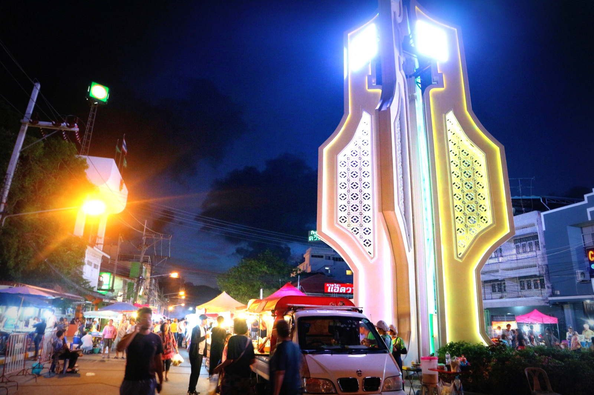
  

  

</header>

<!-- Page content -->

  <!-- About Section -->
  

    

     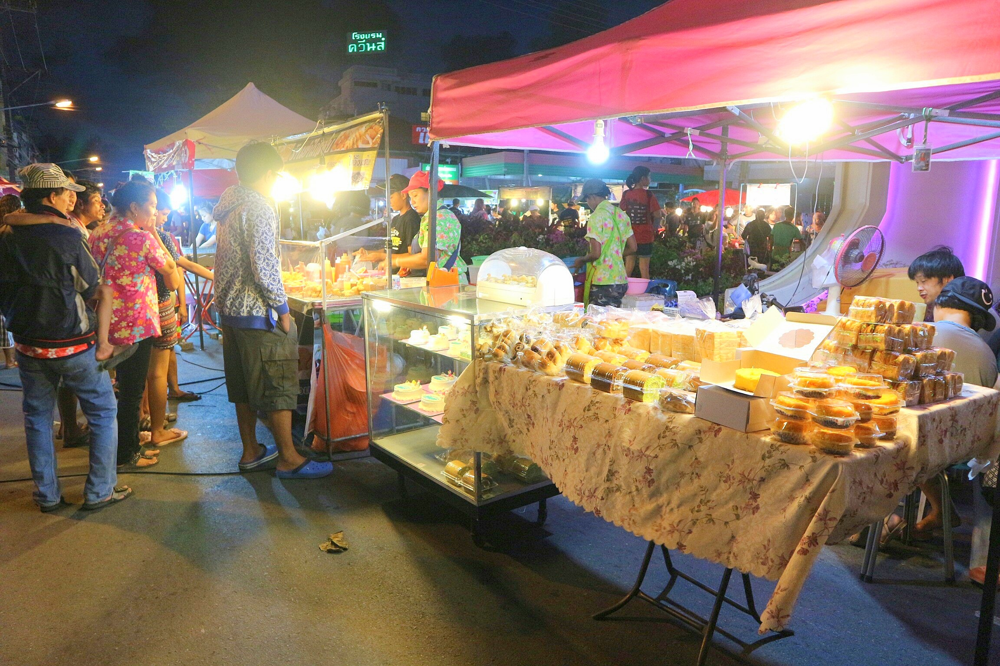
     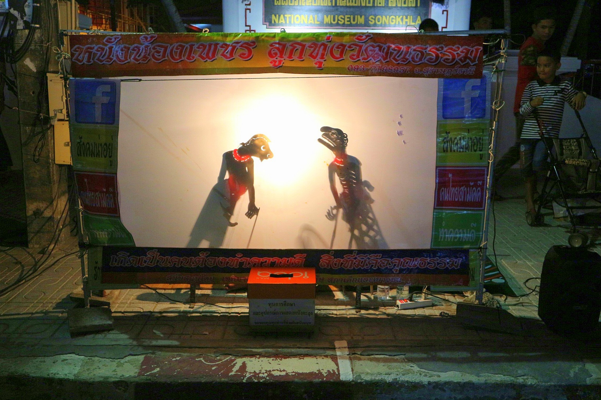

   

    

      <h1 class="w3-center">ถนนคนเดิน สงขลาแต่แรก</h1>
      <h3 class="w3-center">ถนนคนเดินสงขลาแต่แรก เพลินกินของหรอย ย้อนรอยบ่อยาง</h3>
      <h2 class="w3-center">ความประทับใจ</h2>
      
  ถนนคนเดินสงขลาจะจัดขึ้นในช่วงเวลาค่ำคืน เป็นสถานที่ที่มีของมากมายให้เลือกซื้อ เลือกชม ไม่ว่าจะเป็นของกินอร่อยหลายๆอย่าง ของกินขึ้นชื่อของเมืองสงขลา
    อาหารพื้นบ้านที่หาซื้อได้ยาก ของฝากน่ารักๆ เสื้อผ้าสวยๆราคาจับต้องได้ รวมถึงของเก่าๆโบราณด้วย จะเห็นได้ว่ามีคนไปเที่ยวเยอะมากทุกเพศทุกวัย นอกจากจะมีของกินที่อร่อยแล้วก็ยังมีการแสดงบริเวณหน้าพิพิธภัณฑ์พธำมะรงค์
    หรือบ้านของตระกูลติณสูลานนท์ เพื่อให้ประชาชนร่วมแสดง ร่วมร้องเพลงกันอย่างสนุกสานท่ามกลางบรรยากาศเวลาค่ำคืนที่มีแสงไฟประดับสวยงาม เมื่อเดินไปเรื่อยๆ ก็จะเจอกับการแสดงของน้องๆนักเรียนนักศึกษาที่มาโชว์เพื่อหาเงินเข้าชมรม
    มีหนังตะลุงให้ดูกันฟรี ๆ ใครใจดีก็ช่วยบริจาคก็ว่ากันไป ถือได้ว่าไปเที่ยวที่เดียวได้ครบทุกรสชาติทุกอารมณ์กันเลยทีเดียวไม่ว่าจะอิ่มท้อง เพลิดเพลินการแสดง
    แล้วยังได้ร่วมสมทบทุนทำกิจกรรมดีๆอีกด้วย 

      

    

  

  

  <!-- Menu Section -->
  

    

      <h1 class="w3-center w3-card-2">ข้อมูลสถานที่</h1> 
      <h4>ที่ตั้ง</h4>
      
ริมกำแพงเมืองเก่าสงขลา ตำบล บ่อยาง อำเภอเมืองสงขลา สงขลา 90000
 

      <h4></h4>
      

      <h4>วันและเวลาทำการ</h4>
      
ศุกร์และเสาร์ เวลา 17.00 - 22.00 น.
 

      <h4>ค่าเข้าชม</h4>
      
ไม่เก็บค่าบริการ

      <h4>การเดินทาง</h4>
      

    

    

      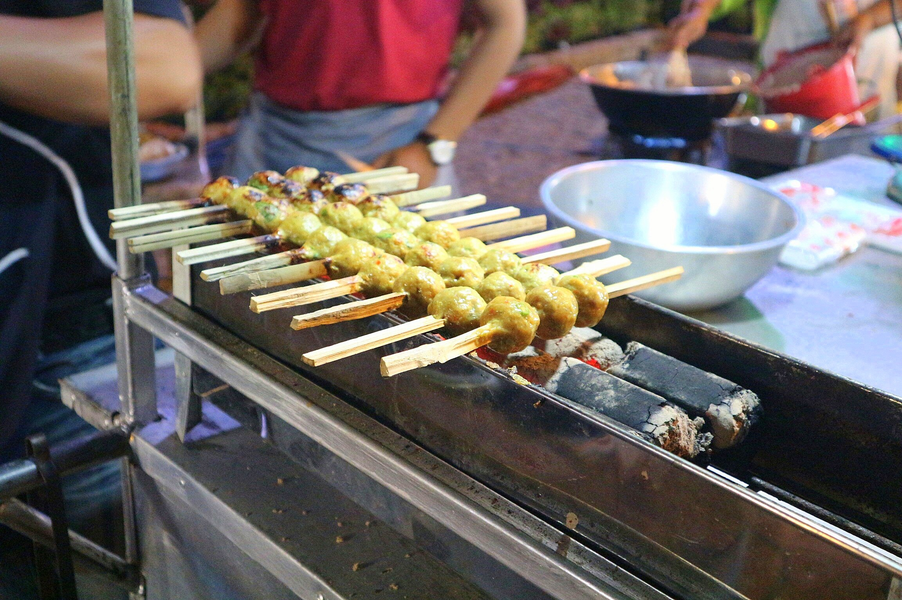
       
      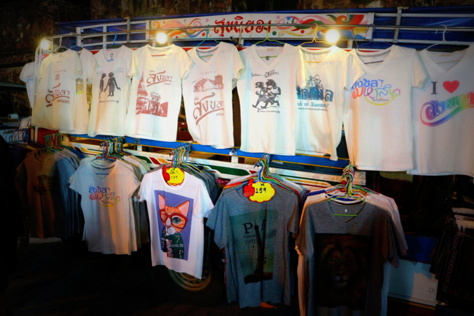
    

  

<h1 class="w3-center w3-card-2">ภาพบรรยากาศ</h1> 
 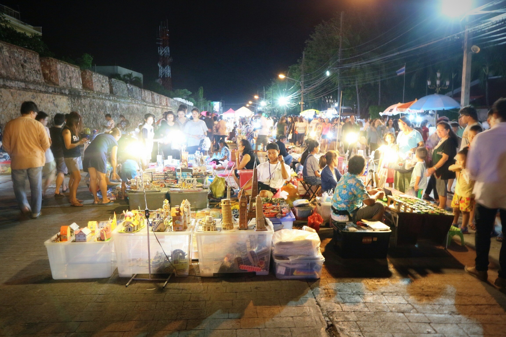
 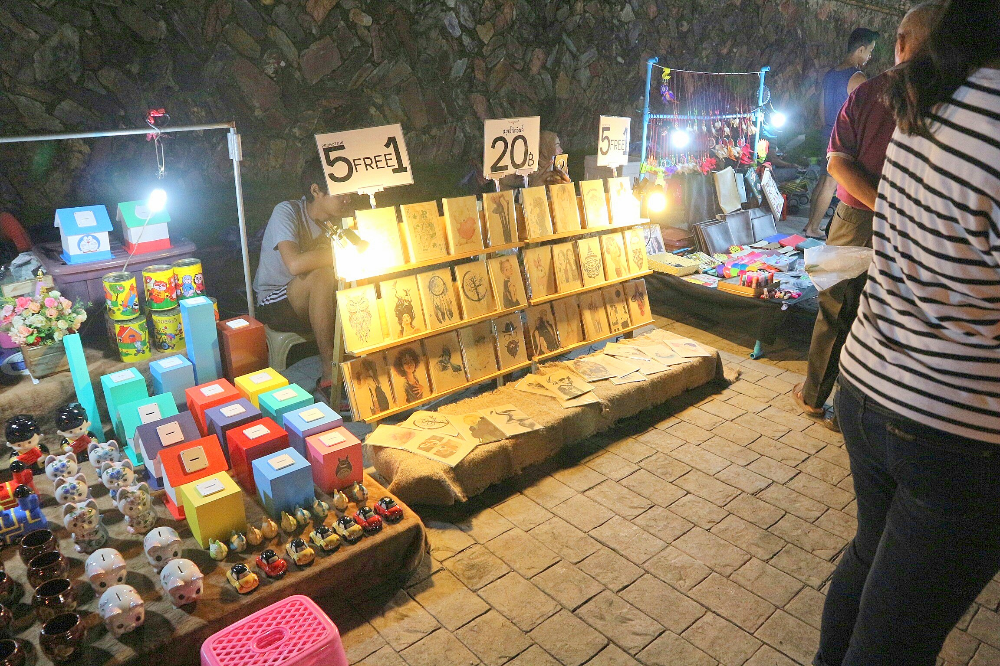
 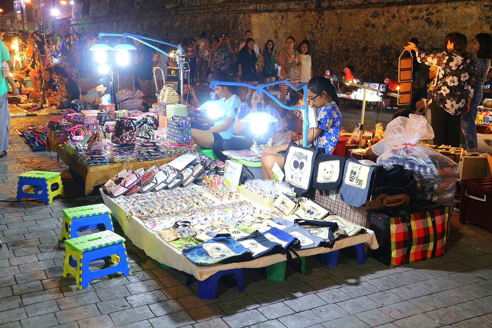
 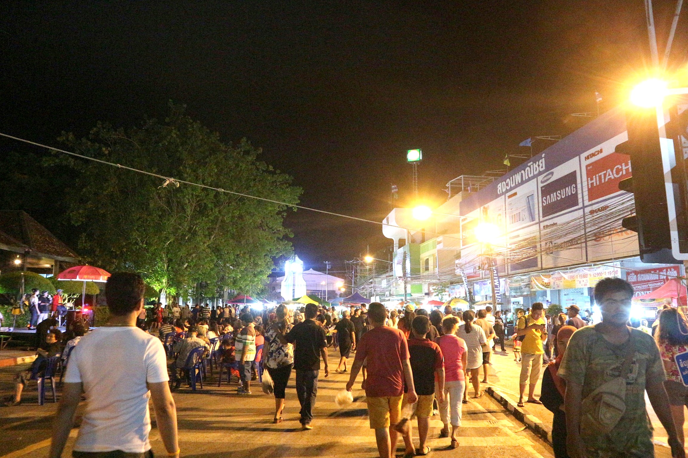
 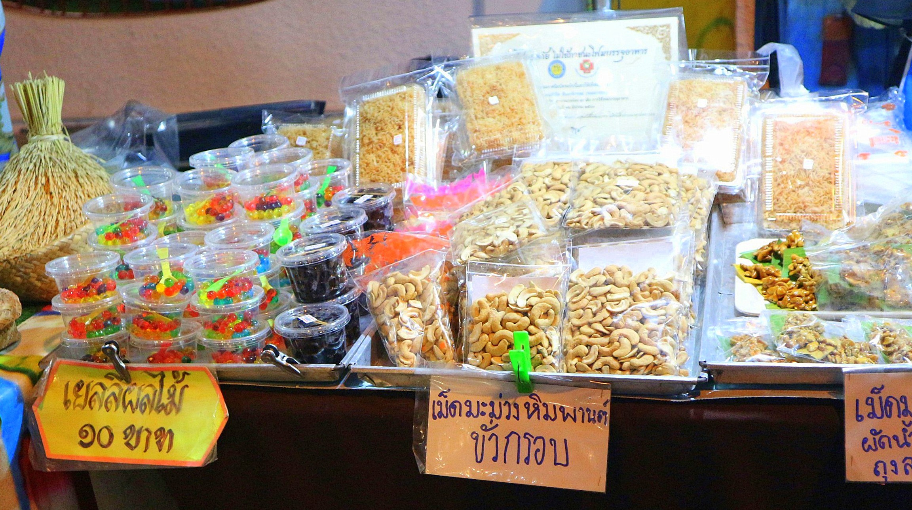
 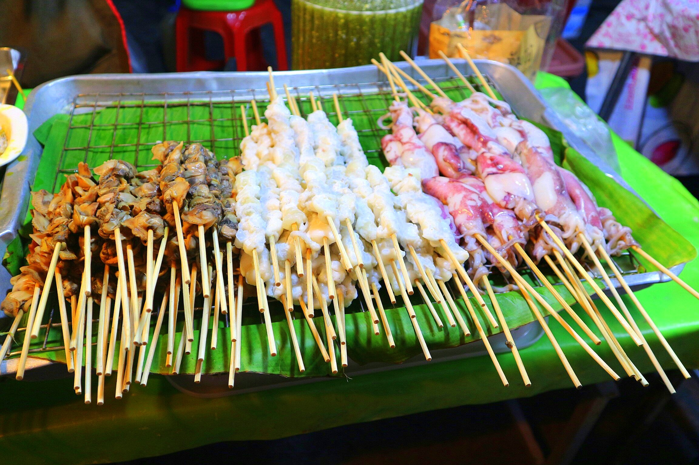

 

<!-- End page content -->

</body>
</html>
